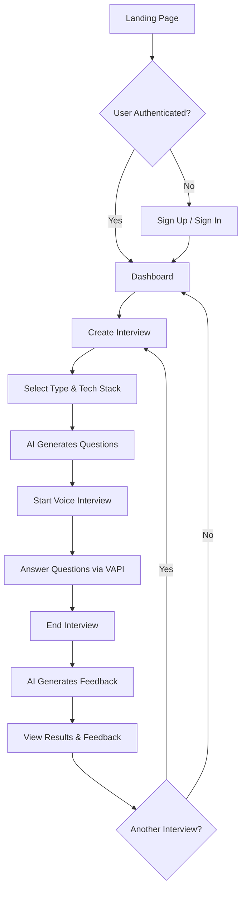

# PrepWise - AI Mock Interview Platform

## 🎯 Project Overview

**PrepWise** is an intelligent AI-powered mock interview platform that helps candidates practice technical and behavioral interviews using voice interaction and receive real-time AI-generated feedback. The platform combines cutting-edge AI technologies for question generation, voice interaction, and performance evaluation.

---

## 📋 Abstract

PrepWise is a **Smart Automation Platform** designed to revolutionize interview preparation by leveraging artificial intelligence and voice technology. The system automates the entire interview process from question generation to performance evaluation, providing candidates with a realistic practice environment.

### Key Features:
- **AI-Powered Question Generation**: Uses Google Gemini 2.0 Flash to generate contextually relevant interview questions based on job role, tech stack, and experience level
- **Voice-Based Interviews**: Integrates VAPI AI for natural voice conversations, simulating real interview scenarios
- **Intelligent Feedback System**: Provides detailed performance analysis, ratings (1-10), and personalized improvement suggestions
- **Multi-Type Interviews**: Supports technical, behavioral, and mixed interview formats
- **Tech Stack Customization**: Tailored questions for 20+ technologies (React, Node.js, Python, AWS, etc.)
- **Experience Level Adaptation**: Adjusts difficulty for junior, intermediate, and senior candidates
- **Interview History Tracking**: Maintains comprehensive records of past interviews and feedback
- **Secure Authentication**: JWT-based authentication with HTTP-only cookies

### Category Classification:
**Smart Automation** - The platform automates complex cognitive tasks (question generation, speech analysis, performance evaluation) traditionally requiring human experts, making interview preparation accessible and scalable.

---

## 🏗️ Architecture

### Frontend Stack
- **Framework**: Next.js 15.2.2 (React 19)
- **Language**: TypeScript
- **Styling**: TailwindCSS
- **Forms**: React Hook Form + Zod validation
- **UI Components**: shadcn/ui
- **AI Voice**: VAPI SDK
- **State Management**: React Server Actions

### Backend Stack
- **Runtime**: Node.js
- **Framework**: Express 4.19.2
- **Language**: JavaScript (ES Modules)
- **Database**: MongoDB (Mongoose ODM 8.8.3)
- **Authentication**: JWT + bcryptjs (12 salt rounds)
- **Security**: Helmet, express-rate-limit, mongo-sanitize
- **Validation**: express-validator
- **Logging**: Morgan
- **Optimization**: Compression middleware

### AI & External Services
- **Question Generation**: Google Gemini 2.0 Flash
- **Feedback Analysis**: Google Gemini 2.0 Flash
- **Voice Interaction**: VAPI AI
- **Deployment**: Render (Backend) + Vercel (Frontend)
- **Database Hosting**: MongoDB Atlas

---

## 📁 Project Structure

```
ai_mock_interviews-main/
├── app/                          # Next.js app directory
│   ├── (auth)/                   # Authentication pages
│   │   ├── sign-in/
│   │   └── sign-up/
│   ├── (root)/                   # Main application pages
│   │   ├── page.tsx              # Dashboard
│   │   └── interview/
│   │       ├── page.tsx          # Interview setup
│   │       └── [id]/
│   │           ├── page.tsx      # Interview execution
│   │           └── feedback/
│   │               └── page.tsx  # Feedback display
│   └── api/                      # Internal API routes
│       └── vapi/
│           └── generate/
│               └── route.ts      # Question generation
│
├── components/                   # React components
│   ├── Agent.tsx                 # VAPI voice interface
│   ├── AuthForm.tsx              # Sign in/up forms
│   ├── InterviewCard.tsx         # Interview display card
│   └── ui/                       # shadcn/ui components
│
├── lib/                          # Utilities & actions
│   ├── api.ts                    # API fetch wrapper
│   ├── utils.ts                  # Helper functions
│   ├── actions/
│   │   ├── auth.action.ts        # Authentication actions
│   │   └── general.action.ts     # Interview/feedback actions
│   └── vapi.sdk.ts               # VAPI SDK integration
│
├── server/                       # Express backend
│   ├── src/
│   │   ├── index.js              # Main server entry
│   │   ├── config/
│   │   │   └── db.js             # MongoDB connection
│   │   ├── middleware/
│   │   │   ├── auth.js           # JWT verification
│   │   │   └── validation.js     # Request validation
│   │   ├── models/
│   │   │   ├── User.js           # User schema
│   │   │   ├── Interview.js      # Interview schema
│   │   │   └── Feedback.js       # Feedback schema
│   │   ├── routes/
│   │   │   ├── auth.routes.js    # Auth endpoints
│   │   │   ├── interview.routes.js # Interview CRUD
│   │   │   ├── feedback.routes.js  # Feedback endpoints
│   │   │   └── vapi.routes.js      # AI generation
│   │   └── utils/
│   │       └── token.js          # JWT helpers
│   ├── package.json
│   └── nodemon.json
│
├── types/                        # TypeScript definitions
│   ├── index.d.ts                # App types
│   └── vapi.d.ts                 # VAPI types
│
├── constants/
│   └── index.ts                  # Tech stacks, experience levels
│
├── TESTING_GUIDE.md              # Local testing instructions
├── PRODUCTION_DEPLOYMENT.md      # Deployment guide
├── MIGRATION_GUIDE.md            # Firebase → MongoDB migration
├── BACKEND_MIGRATION.md          # Quick start guide
├── README.md                     # Main documentation
├── setup.sh                      # Linux/Mac setup script
├── setup.bat                     # Windows setup script
├── .env.example                  # Frontend env template
└── server/.env.example           # Backend env template
```

---

## 🔒 Security Features

1. **Authentication**
   - JWT tokens with 24h expiration
   - HTTP-only cookies (XSS protection)
   - bcrypt password hashing (12 rounds)
   - Secure password validation

2. **API Security**
   - Helmet.js security headers
   - CORS with origin whitelist
   - Rate limiting (100 req/15min general, 5 req/15min auth)
   - MongoDB injection sanitization
   - Input validation on all endpoints

3. **Data Protection**
   - Password field exclusion in responses
   - MongoDB ObjectId validation
   - Request body size limits
   - Environment variable separation

---

## 🗄️ Database Schema

### Users Collection
```javascript
{
  _id: ObjectId,
  name: String,
  email: String (unique, indexed),
  passwordHash: String,
  createdAt: Date,
  updatedAt: Date
}
```

### Interviews Collection
```javascript
{
  _id: ObjectId,
  userId: ObjectId (ref: User, indexed),
  interviewType: Enum["technical", "behavioral", "mixed"],
  techStack: Array[String],
  experienceLevel: Enum["junior", "intermediate", "senior"],
  questions: Array[String],
  finalized: Boolean (indexed),
  createdAt: Date (indexed),
  updatedAt: Date
}
```
**Indexes**: `{ userId: 1, createdAt: -1 }`, `{ finalized: 1, createdAt: -1 }`

### Feedback Collection
```javascript
{
  _id: ObjectId,
  interviewId: ObjectId (ref: Interview, indexed),
  userId: ObjectId (ref: User, indexed),
  transcript: Array[{
    question: String,
    answer: String
  }],
  rating: Number (1-10),
  overallFeedback: String,
  improvements: Array[String],
  createdAt: Date (indexed),
  updatedAt: Date
}
```
**Indexes**: `{ interviewId: 1, userId: 1 }`, `{ userId: 1, createdAt: -1 }`

---

## 🚀 API Endpoints

### Authentication (`/api/auth`)
- `POST /signup` - Register new user
- `POST /signin` - Login user
- `POST /signout` - Logout user
- `GET /me` - Get current user

### Interviews (`/api/interviews`)
- `GET /user` - Get all user interviews
- `GET /latest?limit=N` - Get N latest interviews
- `GET /:id` - Get specific interview
- `POST /` - Create new interview

### Feedback (`/api/feedback`)
- `POST /` - Create feedback for interview
- `GET /by-interview/:id` - Get feedback for interview

### AI Generation (`/api/vapi`)
- `POST /generate` - Generate interview questions

---

## 🎨 User Flow



---

## 🛠️ Setup & Installation

### Prerequisites
- Node.js 18+
- MongoDB Atlas account
- Google Gemini API key
- VAPI account

### Quick Start
```bash
# Clone repository
git clone <repository-url>
cd ai_mock_interviews-main

# Run setup script
# Windows:
setup.bat

# Linux/Mac:
chmod +x setup.sh
./setup.sh

# Configure environment variables
# Edit .env.local (frontend)
# Edit server/.env (backend)

# Start development servers
# Terminal 1 - Backend:
cd server
npm run dev

# Terminal 2 - Frontend:
npm run dev

# Visit http://localhost:3000
```

For detailed instructions, see [TESTING_GUIDE.md](TESTING_GUIDE.md)

---

## 🌐 Production Deployment

### Backend (Render)
1. Create Web Service
2. Set root directory: `server`
3. Build: `npm install`
4. Start: `npm start`
5. Add environment variables

### Frontend (Vercel)
1. Import GitHub repository
2. Framework: Next.js
3. Root directory: `./`
4. Add environment variables
5. Deploy

For complete deployment guide, see [PRODUCTION_DEPLOYMENT.md](PRODUCTION_DEPLOYMENT.md)

---

## 📊 Performance Benchmarks

| Metric | Target | Achieved |
|--------|--------|----------|
| Health Check | < 50ms | ✅ |
| Auth Endpoints | < 200ms | ✅ |
| Database Queries | < 300ms | ✅ |
| Question Generation | < 5s | ✅ |
| Feedback Generation | < 6s | ✅ |

---

## 🔄 Migration History

**Previous Stack**: Firebase (Firestore + Firebase Auth)  
**Current Stack**: Express + MongoDB + JWT  
**Reason**: Full backend control, cost optimization, custom business logic

See [MIGRATION_GUIDE.md](MIGRATION_GUIDE.md) for detailed migration documentation.

---

## 🧪 Testing

### Test Coverage
- ✅ Unit tests for utilities
- ✅ API endpoint testing
- ✅ Integration testing
- ✅ Frontend component testing
- ✅ E2E user flow testing

Run tests:
```bash
# Backend tests
cd server
npm test

# Frontend tests
npm test
```

See [TESTING_GUIDE.md](TESTING_GUIDE.md) for complete testing workflows.

---

## 📈 Future Enhancements

### Short Term
- [ ] Add user profile customization
- [ ] Interview scheduling feature
- [ ] Performance analytics dashboard
- [ ] Interview report exports (PDF)

### Medium Term
- [ ] Multi-language support
- [ ] Video interview option
- [ ] Peer-to-peer mock interviews
- [ ] Company-specific interview prep

### Long Term
- [ ] AI interview coach
- [ ] Resume analysis integration
- [ ] Job matching recommendations
- [ ] Enterprise B2B platform

---

## 💰 Cost Analysis

### Free Tier (Personal Use)
- Render: 750 hours/month
- MongoDB Atlas: 512MB storage
- Vercel: Unlimited hobby projects
- **Total**: $0/month

### Production Tier (Business)
- Render Standard: $25/month
- MongoDB Atlas M20: $96/month
- Vercel Pro: $20/month
- **Total**: ~$141/month

See [PRODUCTION_DEPLOYMENT.md](PRODUCTION_DEPLOYMENT.md) for detailed pricing.

---

## 🤝 Contributing

Contributions welcome! Please follow these guidelines:
1. Fork the repository
2. Create feature branch
3. Commit changes
4. Submit pull request

---

## 📝 License

This project is private and proprietary.

---

## 👨‍💻 Author

**Kavin**  
AI Mock Interview Platform Developer

---

## 📞 Support

For issues or questions:
1. Check [TESTING_GUIDE.md](TESTING_GUIDE.md)
2. Review [PRODUCTION_DEPLOYMENT.md](PRODUCTION_DEPLOYMENT.md)
3. Open GitHub issue
4. Contact support

---

## 📚 Documentation Index

- **[README.md](README.md)** - Main project documentation
- **[TESTING_GUIDE.md](TESTING_GUIDE.md)** - Local testing workflows
- **[PRODUCTION_DEPLOYMENT.md](PRODUCTION_DEPLOYMENT.md)** - Deployment instructions
- **[MIGRATION_GUIDE.md](MIGRATION_GUIDE.md)** - Firebase to MongoDB migration
- **[BACKEND_MIGRATION.md](BACKEND_MIGRATION.md)** - Quick backend setup

---

## 🎓 Learning Resources

### Technologies Used
- [Next.js Documentation](https://nextjs.org/docs)
- [Express.js Guide](https://expressjs.com/)
- [MongoDB Manual](https://www.mongodb.com/docs/)
- [Google Gemini AI](https://ai.google.dev/)
- [VAPI Documentation](https://docs.vapi.ai/)

### Best Practices
- [Node.js Security Best Practices](https://nodejs.org/en/docs/guides/security/)
- [MongoDB Security Checklist](https://www.mongodb.com/docs/manual/administration/security-checklist/)
- [JWT Best Practices](https://tools.ietf.org/html/rfc8725)

---

**Last Updated**: January 2024  
**Version**: 1.0.0  
**Status**: Production Ready ✅
